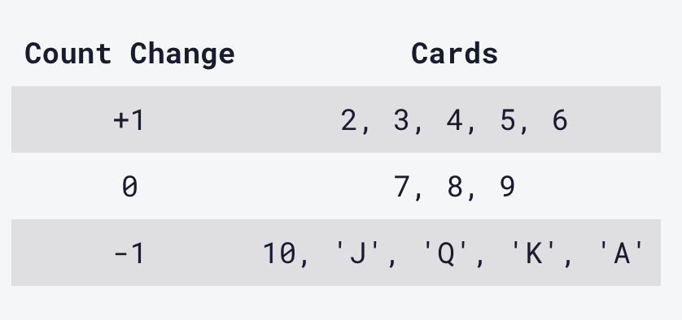

# Counting Cards

- In the casino game Blackjack, a player can gain an advantage over the house by keeping track of the relative number of high and low cards remaining in the deck. This is called Card Counting.

- Having more high cards remaining in the deck favors the player. Each card is assigned a value according to the table below. When the count is positive, the player should bet high. When the count is zero or negative, the player should bet low.

- I have created a card counting function. It will receive a card parameter, which can be a number or a string, and increment or decrement the global count variable according to the card's value. The function will then return a string with the current count and the string Bet if the count is positive, or Hold if the count is zero or negative. The current count and the player's decision (Bet or Hold) should be separated by a single space.

 

#### Example Outputs:
-3 Hold or 5 Bet

#### Hint:
- Do NOT reset count to 0 when value is 7, 8, or 9.
- Do NOT return an array.
- Do NOT include quotes (single or double) in the output.

## Built With

- HTML
- CSS
- JavaScipt
- Webpack
- ES6

## Live Demo

[Live View!!](https://vagyasri.github.io/Counting-Cards/dist/)

## Author

👤 **Bhagyashree Patra**

- GitHub: [@Vagyasri](https://github.com/Vagyasri)
- Twitter: [@Vagyasri](https://twitter.com/Vagyasri)
- LinkedIn: [Bhagyashree Patra](https://www.linkedin.com/in/bhagyashree-patra-029bb059/)

## Getting Started

### Prerequisites:

- Web browser
- Code Editor (VS Code)
- Live Server Extension

### Cloning the repo to your local system (If you already have git, installed in your system):

- [Copy this link](https://github.com/Vagyasri/Counting-Cards.git)
- Open your terminal or command line
- Run "git clone [Paste this link](https://github.com/Vagyasri/Counting-Cards.git)"
- Open the folder with your code editor
- Now You can edit the code and check the changes in the browser using Live Server

### Webpack Setup:

- Initialize `npm`: Run `npm init -y`
- Install `webpack` and  `webpack-cli` locally: Run `npm install webpack webpack-cli --save-dev`

### Implement the changes and Get Live View in Localhost:

- Run: `npm run build`
- Run: `npm start`

### Install Jest using NPM:
- Run: `npm install --save-dev jest`

### For Running Jest:
- Run: `npm run test or npm test`

### Check linter errors:

- Install npm
- For HTML: Run npx hint .
- For CSS: Run npx stylelint "**/*.{css,scss}"
- For JS: Run npx eslint .

## 🤝 Contributing

Contributions, issues, and feature requests are welcome!

Start by:

- Forking the project
- Cloning the project to your local machine
- cd into the Youtube-Replica project directory
- Run git checkout -b your-branch-name
- Make your contributions
- Push your branch up to your forked repository
- Open a Pull Request with a detailed description to the development branch of the original project for a review

Feel free to check the [issues page](https://github.com/Vagyasri/Counting-Cards/issues), contribute to the Project by creating an issue.

## Show your support
Give a ⭐️ if you like this project!
